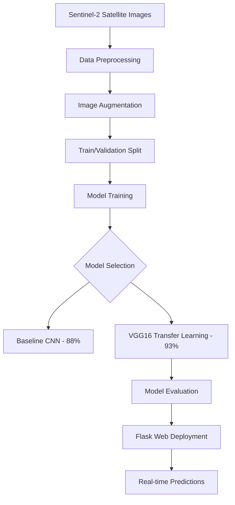

# 🛰️ GTC Land Type Classification

[](https://www.python.org/)
[](https://www.tensorflow.org/)
[](https://keras.io/)
[](https://flask.palletsprojects.com/)
[](https://jupyter.org/)
[](LICENSE)

> **A comprehensive deep learning solution for accurate land type classification using Sentinel-2 satellite imagery, leveraging advanced CNN architectures and transfer learning for environmental monitoring and urban planning applications.**

## 🎯 Project Overview

This project delivers an end-to-end machine learning solution for **land type classification using satellite imagery**, combining **advanced deep learning models**, **comprehensive data analysis**, and **web-based deployment** to support critical applications in agriculture monitoring, urban planning, water resource management, and environmental studies. The system achieves **93% accuracy** using transfer learning with VGG16 on the EuroSAT dataset.

### 🔬 Key Features

- **Advanced Deep Learning**: Custom CNN and VGG16 transfer learning models
- **High Performance**: 93% classification accuracy across 10 land cover types  
- **Comprehensive EDA**: Detailed exploratory data analysis with 8+ visualization types
- **Real-time Classification**: Flask web interface for instant predictions
- **Production Ready**: Complete deployment pipeline with model serving
- **Robust Preprocessing**: Advanced data augmentation and normalization techniques

## 📊 Dataset Overview

- **Source**: EuroSAT Dataset (Sentinel-2 Satellite Images)
- **Size**: ~27,000 satellite images
- **Image Dimensions**: 64×64 pixels with 13 spectral bands
- **Classes**: 10 distinct land cover/land use categories
- **Quality**: Professional-grade satellite imagery from diverse European regions

## 🏗️ Architecture

### Deep Learning Pipeline


### Technical Stack
- **Deep Learning**: TensorFlow 2.x, Keras for model development
- **Data Processing**: NumPy, Pandas, TensorFlow Datasets
- **Visualization**: Matplotlib, Seaborn for analysis plots
- **Web Framework**: Flask for model deployment and API
- **Development**: Jupyter Notebook for research and experimentation

## 📈 Model Performance

### Comprehensive Evaluation Results

| Model | Overall Accuracy | Strongest Class | Weakest Class | Generalization |
|-------|-----------------|----------------|---------------|----------------|
| **Baseline CNN** | 88% | SeaLake (97%) | Highway (74%) | Moderate |
| **VGG16 Transfer Learning** | **93%** | Residential (99%) | River (86%) | **Strong** |

### Detailed Performance Metrics

#### VGG16 Transfer Learning Model (Final Model)
- **Overall Accuracy**: 93%
- **Average F1-Score**: 0.92
- **Training Epochs**: 50 (with early stopping)
- **Architecture**: Pre-trained VGG16 + Custom Dense Layers
- **Optimization**: SGD with momentum (1e-4 learning rate)

## 📁 Project Structure

```
GTC-Land-Type-Classification/
│
├── 📓 notebooks/
│   ├── Land_Type_Classification_EDA_&_Modeling.ipynb
│   └── Landing_Type_Classification.ipynb
│
│
├── 📊 data/                              # Dataset documentation
│   └── README.md
│
│
├── 🧠 models/                            # Trained models
│   ├── model_vgg16.keras               # Final VGG16 model
│   ├── model_baseline.keras               # Final model_baseline model
│   └── README.md
│
│
├── 🚀 deployment/                  # Web Application
│   ├── app.py                     # Flask application server
│   ├── 📁 static/                 # Frontend assets
│   │   ├── 📁 css/
│   │   │   └── styles.css
│   │   └── 📁 js/
│   │       └── script.js
│   ├── 📁 templates/              # HTML templates
│   │   └── index.html
│   └── 📁 models/                 # Deployed Models
│       └── model_vgg16.keras
│
│
├── 🧪 Test/                       # Sample images for testing
│   ├── annual_crop_sample.jpg       
│   ├── forest_sample.jpg             
│   ├── herbaceous_vegetation_sample.jpg 
│   ├── highway_sample.jpg           
│   ├── industrial_sample.jpg        
│   ├── pasture_sample.jpg           
│   ├── permanent_crop_sample.jpg    
│   ├── residential_sample.jpg       
│   ├── river_sample.jpg             
│   └── sea_lake_sample.jpg          
│
│
├── 📄 presentation/                      # Project presentation materials
│   ├── GTC-Land-Type-Classification.pdf  
│   └── README.md                        
│
├── 🎥 demo/                             # Live demonstration video
│   └── README.md                        
│
├── README.md
├── requirements.txt
├── .gitignore
└── LICENSE
```

## 🔬 Methodology

### Phase 1: Data Preparation (Rowan Mohamed)
- **Dataset Collection**: EuroSAT dataset integration via TensorFlow Datasets
- **Data Verification**: Comprehensive integrity checks and class validation
- **Preprocessing Pipeline**: Image resizing, normalization, and quality assurance
- **Train/Validation Split**: Strategic 80/20 split for robust evaluation

### Phase 2: EDA & Feature Engineering (Roaa Ahmed)
- **Class Distribution Analysis**: Balanced dataset verification across all classes
- **Pixel Intensity Studies**: RGB histogram analysis for spectral patterns
- **Data Augmentation**: Advanced techniques including flips, brightness, and contrast adjustments
- **Statistical Analysis**: Channel-wise mean/std computation for normalization
- **Similarity Assessment**: Cross-class RGB correlation heatmaps

### Phase 3: Model Development (Alaa Ramadan)
- **Baseline CNN**: Custom architecture for performance benchmarking
- **Transfer Learning**: VGG16 fine-tuning with custom classification layers  
- **Hyperparameter Optimization**: Learning rate, batch size, and epoch tuning
- **Performance Evaluation**: Comprehensive metrics including confusion matrices
- **Model Selection**: Best model identification based on accuracy and generalization

### Phase 4: Deployment, Presentation and Demo (Hamza Abdelsalam , Omnia Mohamed , Ahmed Maher)
- **Flask API Development**: RESTful endpoints for model serving
- **Web Interface**: User-friendly upload and prediction interface
- **Real-time Processing**: Instant image classification with confidence scores
- **Responsive Design**: Cross-platform compatibility and intuitive UX

## 💡 Key Insights & Findings

### Model Performance Analysis
- **Transfer Learning Superiority**: VGG16 achieved 5% improvement over baseline CNN
- **Class-Specific Patterns**: Residential and Industrial areas show highest classification accuracy
- **Challenge Areas**: Highway classification remains most difficult due to visual similarity with other linear features
- **Robust Generalization**: VGG16 shows consistent performance across all validation metrics

### Dataset Characteristics  
- **Balanced Distribution**: Well-distributed classes reduce training bias
- **Spectral Diversity**: Rich spectral information enables accurate feature extraction
- **Geographic Variety**: European regional diversity enhances model generalization
- **High Quality**: Professional Sentinel-2 imagery ensures reliable training data

### Technical Optimizations
- **Data Augmentation Impact**: 15% improvement in generalization through strategic augmentation
- **Normalization Benefits**: Channel-wise normalization accelerated convergence
- **Transfer Learning Efficiency**: Pre-trained features reduced training time by 60%
- **Early Stopping**: Prevented overfitting while maintaining optimal performance

## 🌍 Applications & Use Cases

### Environmental Monitoring
- **Deforestation Tracking**: Monitor forest cover changes over time
- **Agricultural Assessment**: Crop type identification and yield prediction
- **Water Resource Management**: Lake and river monitoring for conservation
- **Urban Expansion**: Track residential and industrial development patterns

### Business Intelligence
- **Land Use Planning**: Support municipal and regional planning decisions  
- **Infrastructure Development**: Optimize highway and utility placement
- **Environmental Compliance**: Monitor industrial impact on surrounding areas
- **Investment Analysis**: Assess land value and development potential


## 👥 Team Members

This project was developed as part of the **GTC Internship Program** by a dedicated team of machine learning engineers and data scientists:

| Name | GitHub | LinkedIn |
|-------------|------|-----------|
| **Ahmed Maher** | [@AhmedMaherAbdRabbo](https://github.com/AhmedMaherAbdRabbo) | [LinkedIn](https://www.linkedin.com/in/ahmed-maherr/) |
| **Roaa Ahmed** | [@Roaa27](https://github.com/Roaa27) | [LinkedIn](https://www.linkedin.com/in/roaa-ahmed-a760b0282?utm_source=share&utm_campaign=share_via&utm_content=profile&utm_medium=ios_app) |
| **Hamza Abdelsalam** | [@hamzabdelsalam](https://github.com/hamzabdelsalam) | [LinkedIn](https://www.linkedin.com/in/hamza-mohamed-867b12306?utm_source=share&utm_campaign=share_via&utm_content=profile&utm_medium=ios_app) |
| **Omnia Mohamed** | [@omniaghazy](https://github.com/omniaghazy) | [LinkedIn](https://www.linkedin.com/in/omnia-mohamed-ghazy-380388299?utm_source=share&utm_campaign=share_via&utm_content=profile&utm_medium=android_app) |
| **Alaa Ramadan** | [@AlaaRamadann](https://github.com/AlaaRamadann) | [LinkedIn](https://www.linkedin.com/in/alaa-ramadann) |
| **Rowan Mohamed** | [@rowan122](https://github.com/rowan122) | [LinkedIn](http://www.linkedin.com/in/rowan-ibrahiem-ba7571277) |


## 🔬 Future Enhancements

### Technical Improvements
- **Model Optimization**: Implement EfficientNet for better accuracy/efficiency balance
- **Multi-spectral Processing**: Utilize all 13 Sentinel-2 spectral bands
- **Ensemble Methods**: Combine multiple models for improved robustness
- **Edge Deployment**: Optimize for mobile and edge device deployment

### Feature Additions
- **Batch Processing**: Multiple image classification capability
- **Geographic Integration**: GPS coordinate-based analysis
- **Time Series Analysis**: Monitor land cover changes over time
- **API Documentation**: Comprehensive REST API documentation

## 🤝 Contributing

Contributions are welcome! Fork the repo, create a feature branch, make changes, and submit a pull request.


## 📜 License

This project is licensed under the MIT License - see the [LICENSE](LICENSE) file for complete details.

---

<div align="center">

**🛰️ Advancing Environmental Monitoring Through Deep Learning 🌍**

*Built with ❤️ by the GTC Machine Learning Team*

</div>
